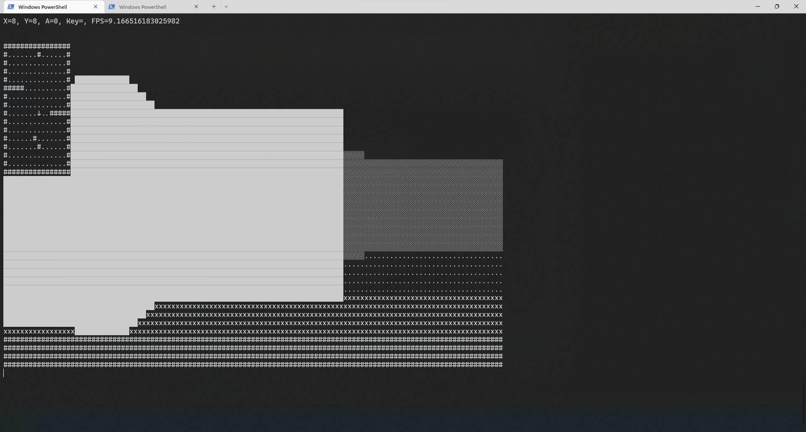
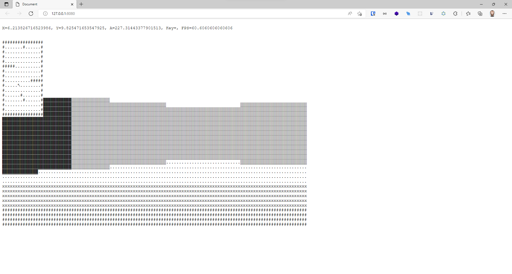
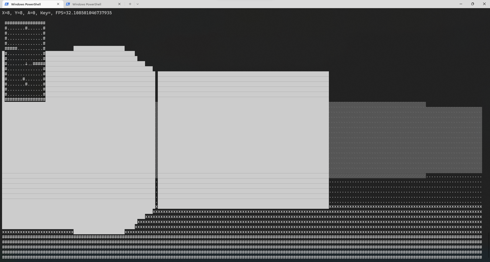

# Deno Cross platform

Based on [CommandLineFPS](https://github.com/OneLoneCoder/CommandLineFPS)

This program attempt to run the same program using 3 environments.

## Run in console



```batch
deno run --unstable .\mod.ts
```

> Press c to quit

## Run in browser



```batch
deno bundle --unstable mod.ts bundle.js
npx http-server .
```

## Run in console using ffi deno plugin (works only on Windows)



Require rustup-msvc to be installed

```batch
deno install -Afq -n deno_bindgen https://deno.land/x/deno_bindgen/cli.ts
cd windows-terminal
deno_bindgen --release
cd ..
deno run -A --unstable --allow-ffi .\mod-native.ts
```

> Press c to quit
